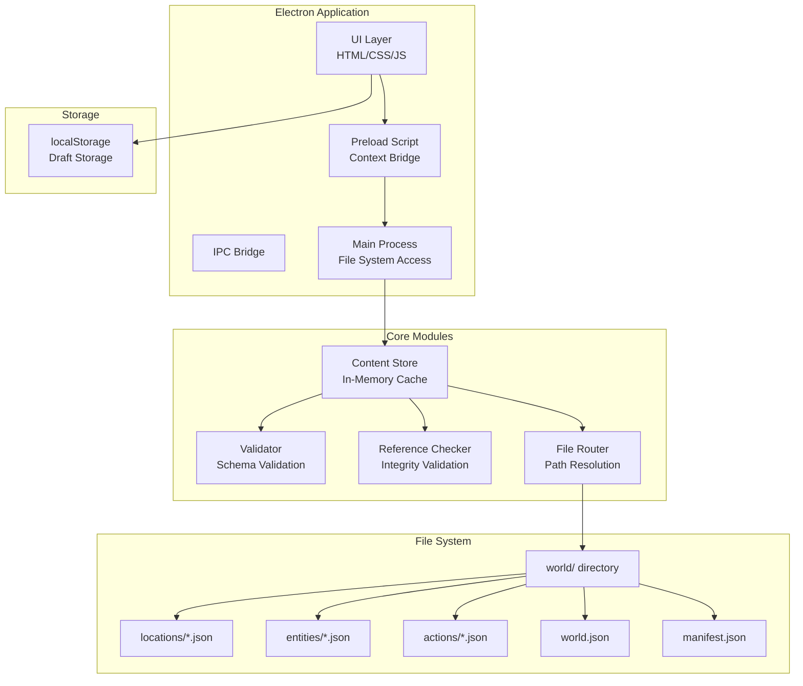
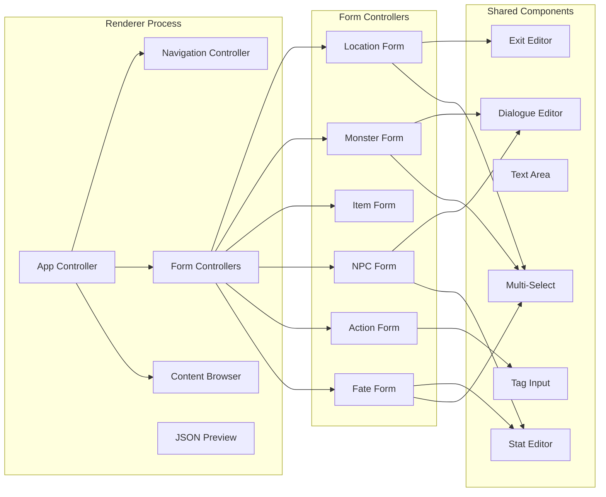
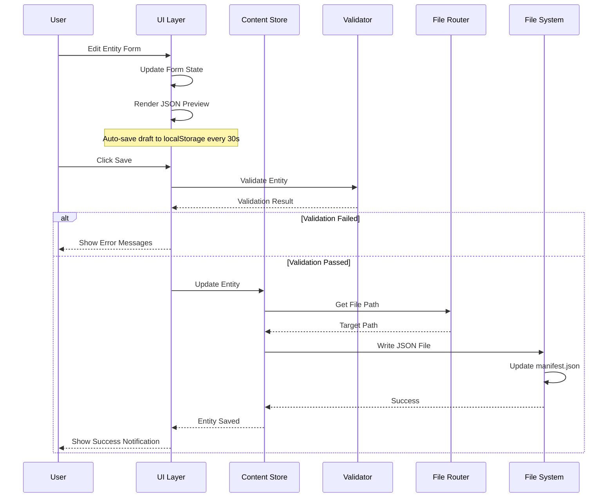
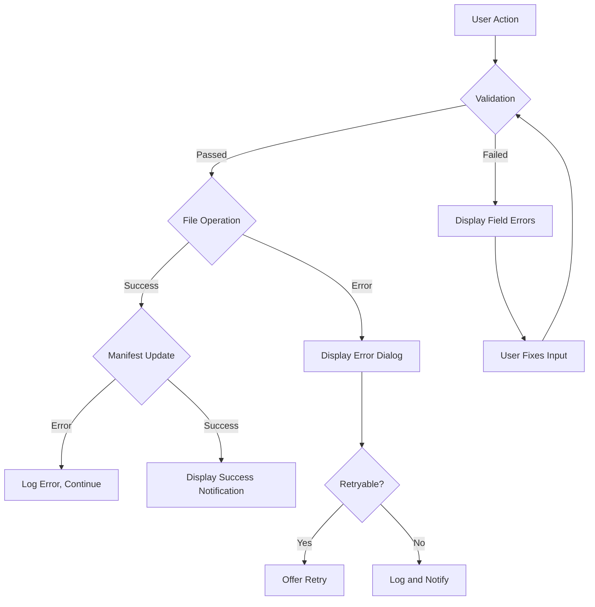

# Design Document

**Feature:** Content Editor for Text RPG

## Overview

The Content Editor is an Electron-based desktop application that provides a graphical interface for creating and editing game content (locations, monsters, items, NPCs, actions, and Fates) for the text RPG. The application operates directly on the project's file system, enabling instant saves to the appropriate JSON files without manual export steps.

### Key Design Principles

1. **Direct File System Access**: Electron's Node.js integration enables direct reads/writes to the `world/` directory
2. **Type-Safe Data Models**: All entity types have defined TypeScript interfaces with validation
3. **Reference Integrity**: Cross-references between entities are validated in real-time
4. **Draft Recovery**: Auto-save to localStorage prevents data loss during editing sessions
5. **Single-Source of Truth**: JSON files in `world/` are the authoritative data source

### Technology Stack

- **Runtime**: Electron (Chromium + Node.js)
- **Language**: TypeScript
- **UI Framework**: Vanilla JS/HTML/CSS (lightweight, no framework dependency)
- **Build**: electron-builder for exe packaging
- **Testing**: Vitest for unit/integration tests, fast-check for property-based tests

---

## Architecture

### High-Level System Architecture



### Component Architecture



### Data Flow



---

## Components and Interfaces

### Main Process API (via Context Bridge)

```typescript
// Exposed via contextBridge.exposeInMainWorld('editor', {...})
interface EditorAPI {
  // File Operations
  loadWorld(): Promise<WorldData>;
  loadManifest(): Promise<Manifest>;
  saveLocation(location: Location): Promise<SaveResult>;
  saveEntity(entity: Entity, targetType: EntityType): Promise<SaveResult>;
  saveAction(action: ActionFile): Promise<SaveResult>;
  saveFate(fate: Fate): Promise<SaveResult>;
  deleteEntity(id: string, type: EntityType): Promise<void>;
  
  // Reference Queries
  getLocations(): Promise<Location[]>;
  getEntities(): Promise<Entity[]>;
  getItems(): Promise<Item[]>;
  getFates(): Promise<Fate[]>;
  
  // Reference Integrity
  checkLocationReference(targetId: string): Promise<ReferenceCheck>;
  checkEntityReference(entityId: string): Promise<ReferenceCheck>;
  checkItemReference(itemId: string): Promise<ReferenceCheck>;
  findReferencesToEntity(entityId: string): Promise<ReferenceLocation[]>;
  
  // Draft Management
  saveDraft(key: string, data: unknown): void;
  loadDraft(key: string): unknown | null;
  clearDraft(key: string): void;
}

interface SaveResult {
  success: boolean;
  path?: string;
  error?: string;
}

interface ReferenceCheck {
  exists: boolean;
  name?: string;
}

interface ReferenceLocation {
  type: 'location' | 'entity' | 'action';
  id: string;
  field: string;
}
```

### Content Store

The Content Store maintains an in-memory cache of all loaded content for fast reference checking and UI rendering.

```typescript
interface ContentStore {
  // State
  locations: Map<string, Location>;
  entities: Map<string, Entity>;
  items: Map<string, Item>;
  monsters: Map<string, Monster>;
  npcs: Map<string, NPC>;
  actions: Map<string, ActionFile>;
  fates: Map<string, Fate>;
  manifest: Manifest;
  
  // Methods
  loadAll(): Promise<void>;
  getLocation(id: string): Location | undefined;
  getEntity(id: string): Entity | undefined;
  getItem(id: string): Item | undefined;
  getMonster(id: string): Monster | undefined;
  getNPC(id: string): NPC | undefined;
  getAction(id: string): ActionFile | undefined;
  getFate(id: string): Fate | undefined;
  
  // Mutations
  addLocation(location: Location): void;
  updateLocation(location: Location): void;
  deleteLocation(id: string): void;
  addEntity(entity: Entity): void;
  updateEntity(entity: Entity): void;
  deleteEntity(id: string): void;
  // ... similar for other types
}
```

### File Router

Determines the correct file path for each entity type based on ID and tags.

```typescript
interface FileRouter {
  getLocationPath(id: string): string;
  getEntityPath(entity: Entity): string;
  getActionPath(id: string): string;
  getFatePath(): string;
  
  // NPC file routing based on tags
  getNPCFilePath(npc: NPC): string;
  findExistingNPCFile(id: string): string | null;
}

// Routing rules:
// - Locations: world/locations/{id}.json
// - Monsters: world/entities/monsters.json
// - Items: world/entities/items.json
// - NPCs: world/entities/{group}_npcs.json (based on tags)
//   - Tags containing city names (agerut, etc.) -> agerut_npcs.json
//   - Tags containing camp names -> bone_hunters_camp.json
//   - Default: world/entities/npcs.json (create if needed)
// - Actions: world/actions/{category}_actions.json
// - Fates: world/world.json (fates object)
```

### Validator

Validates entity data before saving.

```typescript
interface Validator {
  validateLocation(location: Location): ValidationResult;
  validateMonster(monster: Monster): ValidationResult;
  validateItem(item: Item): ValidationResult;
  validateNPC(npc: NPC): ValidationResult;
  validateAction(action: ActionFile): ValidationResult;
  validateFate(fate: Fate): ValidationResult;
}

interface ValidationResult {
  valid: boolean;
  errors: ValidationError[];
}

interface ValidationError {
  field: string;
  message: string;
}

// Validation rules:
// - ID: required, snake_case format (^[a-z][a-z0-9_]*$)
// - Name: required, non-empty string
// - Numeric fields: positive values (hp, maxHp, damage, difficulty)
// - References: must exist in loaded data
// - Arrays: can be empty but must be valid arrays
```

### Reference Checker

Provides real-time integrity validation for cross-references.

```typescript
interface ReferenceChecker {
  // Check if a reference target exists
  checkLocationExists(id: string): boolean;
  checkEntityExists(id: string): boolean;
  checkItemExists(id: string): boolean;
  
  // Find all references to an entity (for deletion warnings)
  findReferencesTo(id: string): ReferenceLocation[];
  
  // Validate all references in an entity
  validateLocationReferences(location: Location): ReferenceWarning[];
  validateMonsterReferences(monster: Monster): ReferenceWarning[];
  validateNPCReferences(npc: NPC): ReferenceWarning[];
  validateFateReferences(fate: Fate): ReferenceWarning[];
}

interface ReferenceWarning {
  type: 'missing' | 'broken_on_change';
  field: string;
  targetId: string;
  message: string;
}
```

---

## Data Models

### Location

```typescript
interface Location {
  id: string;                    // snake_case, unique
  title: string;                 // Russian name
  titleEn: string;               // English name
  tags: string[];                // Location tags
  description: string;           // Long description
  atmosphere?: string;           // Optional atmosphere text
  exits: Exit[];                 // Available exits
  entities: string[];            // Entity IDs present in location
  difficultyModifier: number;    // Difficulty modifier (can be 0)
}

interface Exit {
  target: string;                // Target location ID
  label: string;                 // Display label (Russian)
  direction: string;             // Compass direction
  durationSeconds: number;       // Travel time
}
```

### Entity (Base)

```typescript
interface Entity {
  id: string;                    // snake_case, unique
  kind: 'monster' | 'item' | 'npc';
  name: string;                  // Russian name
  aliases: string[];             // Alternative names for parsing
  tags: string[];                // Entity tags
  description: string;           // Description text
}
```

### Monster

```typescript
interface Monster extends Entity {
  kind: 'monster';
  hp: number;                    // Current HP
  maxHp: number;                 // Maximum HP
  damage: number;                // Damage value
  loot: string[];                // Item IDs dropped on death
  dialogue: Dialogue;            // Dialogue options
}

interface Dialogue {
  closed?: string[];             // Neutral dialogue
  warm?: string[];               // Friendly dialogue
  hostile?: string[];            // Hostile dialogue
}
```

### Item

```typescript
interface Item extends Entity {
  kind: 'item';
  statBonuses?: Partial<Stats>;  // Optional stat bonuses
  damageType?: DamageType;       // Optional damage type
}

interface Stats {
  strength: number;
  agility: number;
  luck: number;
  wisdom: number;
  constitution: number;
  charisma: number;
  perception: number;
  intelligence: number;
}

type DamageType = 'fire' | 'ice' | 'poison' | 'holy' | 'physical';
```

### NPC

```typescript
interface NPC extends Entity {
  kind: 'npc';
  hp: number;
  maxHp: number;
  damage: number;
  loot: string[];
  description: string;
  dialogue: Dialogue;
  attitudeByFate: Record<string, number>;  // Fate ID -> attitude (-5 to +5)
}
```

### Action

```typescript
interface ActionFile {
  id: string;                    // File identifier (e.g., 'combat_actions')
  verbs: Verb[];
  rules: Rule[];
  fallbacks: Fallback[];
}

interface Verb {
  id: string;                    // Verb identifier
  words: string[];               // Russian words that trigger this verb
  tags: string[];                // Verb tags for fallback matching
  defaultTarget?: string;        // Default target type
}

interface Rule {
  id: string;                    // Rule identifier
  verb: string;                  // Verb ID this rule applies to
  targetKind: string;            // Target type (npc, any_creature, etc.)
  stat: string;                  // Stat used for check
  difficulty: number;            // Difficulty number
  dice: 'always' | 'sometimes';  // Dice roll behavior
  successText: string;           // Success message
  failureText: string;           // Failure message
  criticalFailureText?: string;  // Critical failure message
}

interface Fallback {
  verbTags: string[];            // Match verbs with these tags
  targetTags: string[];          // Match targets with these tags
  text: string;                  // Fallback response text
}
```

### Fate

```typescript
interface Fate {
  id: string;                    // snake_case, unique
  name: string;                  // Russian name
  nameEn: string;                // English name
  epithet: string;               // Character epithet
  description: string;           // Background description
  stats: FateStats;              // Starting stats
  startingItems: string[];       // Starting item IDs
  reputation: number;            // Starting reputation
  quote: string;                 // Character quote
}

interface FateStats {
  hp: number;
  maxHp: number;
  strength: number;
  agility: number;
  luck: number;
  wisdom: number;
  constitution: number;
  charisma: number;
  perception: number;
  intelligence: number;
}
```

### Manifest

```typescript
interface Manifest {
  configs: string[];             // Config file paths
  locations: string[];           // Location file paths (sorted)
  entities: string[];            // Entity file paths (sorted)
  actions: string[];             // Action file paths (sorted)
}
```

### World Data

```typescript
interface WorldData {
  title: string;
  subtitle: string;
  version: string;
  startLocation: string;
  settings: WorldSettings;
  fates: Record<string, Fate>;
}

interface WorldSettings {
  turnMinutes: number;
  startingTimeMinutes: number;
  transitSecondsDefault: number;
}
```

---

## Correctness Properties

*A property is a characteristic or behavior that should hold true across all valid executions of a system—essentially, a formal statement about what the system should do. Properties serve as the bridge between human-readable specifications and machine-verifiable correctness guarantees.*

### Property 1: JSON Preview Consistency

*For any* form state in the editor, the JSON preview shall be valid JSON that parses to an object matching the current form values.

**Validates: Requirements 1.7**

### Property 2: Entity Update Preserves Uniqueness

*For any* entity list and entity update operation with an existing ID, the resulting list shall contain exactly one entity with that ID, with all updated values merged correctly.

**Validates: Requirements 2.5, 3.5, 6.5**

### Property 3: NPC File Routing

*For any* NPC with specific tag combinations, the file router shall return a deterministic target file path that follows the routing rules (city tags → city_npcs.json, camp tags → camp_npcs.json, etc.).

**Validates: Requirements 4.4**

### Property 4: Rule-Verb Reference Integrity

*For any* action configuration, all rules shall reference verb IDs that exist in the verbs array of the same action file.

**Validates: Requirements 5.3**

### Property 5: Manifest Path Idempotence

*For any* manifest and any path, adding the same path multiple times shall result in the same manifest as adding it once.

**Validates: Requirements 7.3**

### Property 6: Manifest Array Sorting

*For any* manifest update operation, all arrays in the manifest shall remain sorted alphabetically.

**Validates: Requirements 7.4**

### Property 7: Required Field Validation

*For any* entity with missing required fields, validation shall return errors identifying each missing field.

**Validates: Requirements 8.1**

### Property 8: ID Format Validation

*For any* entity ID, it shall match the snake_case pattern `^[a-z][a-z0-9_]*$`.

**Validates: Requirements 8.2**

### Property 9: Numeric Field Validation

*For any* entity with numeric fields (hp, maxHp, damage, difficulty), values shall be non-negative integers.

**Validates: Requirements 8.3**

### Property 10: Location Reference Integrity

*For any* exit target ID in a location, the referenced location shall exist in the loaded locations collection.

**Validates: Requirements 12.1**

### Property 11: Entity Reference Integrity

*For any* entity ID referenced in a location's entities array, the entity shall exist in the loaded entities collection.

**Validates: Requirements 12.2**

### Property 12: Item Reference Integrity

*For any* item ID referenced in loot or startingItems arrays, the item shall exist in the loaded items collection.

**Validates: Requirements 12.3**

---

## Error Handling

### Error Categories

1. **Validation Errors**: User input fails schema or business rule validation
2. **File System Errors**: Read/write failures, missing files, permission issues
3. **Reference Errors**: Missing or broken cross-references between entities
4. **Application Errors**: Unexpected runtime errors

### Error Display Strategy

| Error Type | Display Method | User Action |
|------------|---------------|-------------|
| Validation | Inline field errors + summary | Fix fields before saving |
| File System | Modal dialog with details | Retry or check permissions |
| Reference | Inline warning with suggestion | Create entity or select existing |
| Application | Toast notification | Report issue, restart if needed |

### Error Messages

```typescript
const ERROR_MESSAGES = {
  // Validation
  ID_REQUIRED: 'ID обязателен',
  ID_FORMAT: 'ID должен быть в формате snake_case (строчные буквы, цифры, подчёркивания)',
  ID_EXISTS: 'Сущность с таким ID уже существует',
  NAME_REQUIRED: 'Название обязательно',
  POSITIVE_VALUE: 'Значение должно быть положительным числом',
  
  // File System
  FILE_READ_ERROR: 'Ошибка чтения файла: {path}',
  FILE_WRITE_ERROR: 'Ошибка записи файла: {path}',
  FILE_NOT_FOUND: 'Файл не найден: {path}',
  MANIFEST_MISSING: 'manifest.json не найден, будет создан новый',
  
  // References
  MISSING_LOCATION: 'Локация "{id}" не найдена',
  MISSING_ENTITY: 'Сущность "{id}" не найдена',
  MISSING_ITEM: 'Предмет "{id}" не найдена',
  ID_CHANGE_WARNING: 'Изменение ID может нарушить связи в других сущностях',
};
```

### Error Handling Flow



---

## Testing Strategy

### Unit Tests

Unit tests verify individual functions and components in isolation.

**Scope:**
- Validator functions (ID format, numeric ranges, required fields)
- File router logic (path resolution for each entity type)
- Reference checker functions
- Entity update/merge logic
- JSON serialization/deserialization

**Examples:**
- `validateId('valid_id')` returns `{ valid: true, errors: [] }`
- `validateId('Invalid-ID')` returns `{ valid: false, errors: [...] }`
- `getLocationPath('south_gate')` returns `'world/locations/south_gate.json'`
- `mergeEntity(existingEntity, updates)` preserves ID and merges other fields

### Property-Based Tests

Property-based tests verify universal properties across many generated inputs using fast-check.

**Configuration:**
- Minimum 100 iterations per property
- Each test tagged with: `// Feature: content-editor, Property N: {property_text}`

**Properties to Test:**

```typescript
// Property 1: JSON Preview Consistency
fc.assert(fc.property(
  arbitraryFormData(),
  (formData) => {
    const preview = generateJSONPreview(formData);
    const parsed = JSON.parse(preview);
    expect(parsed).toMatchObject(formData);
  }
));

// Property 2: Entity Update Preserves Uniqueness
fc.assert(fc.property(
  arbitraryEntityList(),
  arbitraryEntity(),
  (list, entity) => {
    const updated = updateEntityInList(list, entity);
    const matching = updated.filter(e => e.id === entity.id);
    expect(matching.length).toBe(1);
    expect(matching[0]).toMatchObject(entity);
  }
));

// Property 5: Manifest Path Idempotence
fc.assert(fc.property(
  arbitraryManifest(),
  arbitraryPath(),
  (manifest, path) => {
    const addedOnce = addPathToManifest(manifest, path);
    const addedTwice = addPathToManifest(addedOnce, path);
    expect(addedTwice).toEqual(addedOnce);
  }
));

// Property 6: Manifest Array Sorting
fc.assert(fc.property(
  arbitraryManifest(),
  arbitraryPath(),
  (manifest, path) => {
    const updated = addPathToManifest(manifest, path);
    Object.values(updated).forEach(arr => {
      expect([...arr].sort()).toEqual(arr);
    });
  }
));

// Property 8: ID Format Validation
fc.assert(fc.property(
  arbitraryString(),
  (str) => {
    const result = validateId(str);
    const matchesPattern = /^[a-z][a-z0-9_]*$/.test(str);
    expect(result.valid).toBe(matchesPattern);
  }
));

// Property 10: Location Reference Integrity
fc.assert(fc.property(
  arbitraryLocations(),
  arbitraryLocation(),
  (locations, location) => {
    const checker = new ReferenceChecker(locations);
    const warnings = checker.validateLocationReferences(location);
    const missingTargets = location.exits
      .filter(e => !checker.checkLocationExists(e.target));
    expect(warnings.filter(w => w.type === 'missing').length)
      .toBe(missingTargets.length);
  }
));
```

### Integration Tests

Integration tests verify interactions with the file system and between components.

**Scope:**
- Loading all content from `world/` directory
- Saving entities to correct files
- Manifest synchronization after save/delete
- Draft persistence to localStorage
- Reference checking across loaded data

**Test Setup:**
- Use mock file system (memfs) for isolation
- Create test fixtures matching actual JSON structure
- Test both happy path and error scenarios

**Examples:**
```typescript
describe('ContentStore integration', () => {
  it('loads all locations from world/locations/', async () => {
    const store = new ContentStore(mockFs);
    await store.loadAll();
    expect(store.locations.size).toBeGreaterThan(0);
  });
  
  it('saves location to correct file', async () => {
    const store = new ContentStore(mockFs);
    const location = { id: 'test_location', ... };
    await store.addLocation(location);
    const filePath = mockFs.readFileSync('world/locations/test_location.json');
    expect(JSON.parse(filePath)).toMatchObject(location);
  });
  
  it('updates manifest after save', async () => {
    const store = new ContentStore(mockFs);
    await store.addLocation({ id: 'new_location', ... });
    const manifest = JSON.parse(mockFs.readFileSync('world/manifest.json'));
    expect(manifest.locations).toContain('world/locations/new_location.json');
  });
});
```

### UI Tests

Manual or automated tests for UI components and flows.

**Scope:**
- Form rendering with correct fields
- Multi-select population from loaded data
- JSON preview updates
- Error message display
- Success notifications
- Draft restoration prompt

**Tool:** Playwright for automated browser testing

---

## File Structure

```
d:\TexT_RPG\
├── editor/
│   ├── main.js                 # Electron main process
│   ├── preload.js              # Context bridge for IPC
│   ├── src/
│   │   ├── index.html          # Main HTML
│   │   ├── styles/
│   │   │   └── editor.css      # Editor styles
│   │   ├── js/
│   │   │   ├── app.js          # Application controller
│   │   │   ├── store.js        # Content store
│   │   │   ├── router.js       # File router
│   │   │   ├── validator.js    # Validation logic
│   │   │   ├── reference-checker.js
│   │   │   ├── components/
│   │   │   │   ├── location-form.js
│   │   │   │   ├── monster-form.js
│   │   │   │   ├── item-form.js
│   │   │   │   ├── npc-form.js
│   │   │   │   ├── action-form.js
│   │   │   │   ├── fate-form.js
│   │   │   │   ├── multi-select.js
│   │   │   │   ├── tag-input.js
│   │   │   │   ├── exit-editor.js
│   │   │   │   ├── dialogue-editor.js
│   │   │   │   └── stat-editor.js
│   │   │   └── utils/
│   │   │       ├── id-generator.js
│   │   │       ├── draft-manager.js
│   │   │       └── json-preview.js
│   │   └── types/
│   │       └── index.d.ts      # TypeScript declarations
│   ├── tests/
│   │   ├── unit/
│   │   │   ├── validator.test.js
│   │   │   ├── router.test.js
│   │   │   └── reference-checker.test.js
│   │   ├── property/
│   │   │   └── correctness-properties.test.js
│   │   └── integration/
│   │       ├── store.test.js
│   │       └── file-operations.test.js
│   └── electron-builder.yml    # Build configuration
├── world/                      # Existing content directory
├── package.json                # Project config (to be created)
└── README.md
```

---

## Implementation Notes

### Electron Main Process

The main process handles all file system operations and exposes them via IPC:

```javascript
// main.js
const { app, BrowserWindow, ipcMain } = require('electron');
const path = require('path');
const fs = require('fs').promises;

const PROJECT_ROOT = path.resolve(__dirname, '..');
const WORLD_DIR = path.join(PROJECT_ROOT, 'world');

ipcMain.handle('load-world', async () => {
  const worldPath = path.join(WORLD_DIR, 'world.json');
  const data = await fs.readFile(worldPath, 'utf-8');
  return JSON.parse(data);
});

ipcMain.handle('save-location', async (event, location) => {
  const filePath = path.join(WORLD_DIR, 'locations', `${location.id}.json`);
  await fs.writeFile(filePath, JSON.stringify(location, null, 2));
  await updateManifest('locations', filePath);
  return { success: true, path: filePath };
});

// ... other handlers
```

### Draft Auto-Save

Drafts are saved to localStorage every 30 seconds:

```javascript
class DraftManager {
  constructor() {
    this.drafts = new Map();
    this.interval = null;
  }
  
  start() {
    this.interval = setInterval(() => this.saveAll(), 30000);
  }
  
  save(key, data) {
    this.drafts.set(key, data);
  }
  
  saveAll() {
    for (const [key, data] of this.drafts) {
      localStorage.setItem(`draft_${key}`, JSON.stringify(data));
    }
  }
  
  load(key) {
    const stored = localStorage.getItem(`draft_${key}`);
    return stored ? JSON.parse(stored) : null;
  }
}
```

### Reference Checking Flow

```javascript
async function checkReferencesBeforeSave(entity, type) {
  const warnings = [];
  
  if (type === 'location') {
    for (const exit of entity.exits) {
      const exists = await window.editor.checkLocationReference(exit.target);
      if (!exists) {
        warnings.push({
          field: 'exits',
          message: `Локация "${exit.target}" не найдена`,
          suggestion: 'create_or_select'
        });
      }
    }
  }
  
  // ... check other reference types
  
  return warnings;
}
```

---

## Design Decisions

| Decision | Rationale |
|----------|-----------|
| Electron over web app | Direct file system access without server; desktop app for offline editing |
| Vanilla JS over framework | Lightweight, no build complexity, sufficient for CRUD forms |
| In-memory content cache | Fast reference checking without repeated file reads |
| JSON files as source of truth | Compatibility with existing game; no database migration needed |
| localStorage for drafts | Simple, persistent storage for unsaved work |
| Separate entity files by group | Organized content; easier version control; matches existing structure |
| Sorted manifest arrays | Human-readable diffs in version control |
